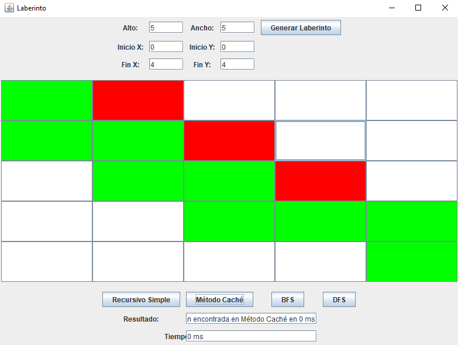
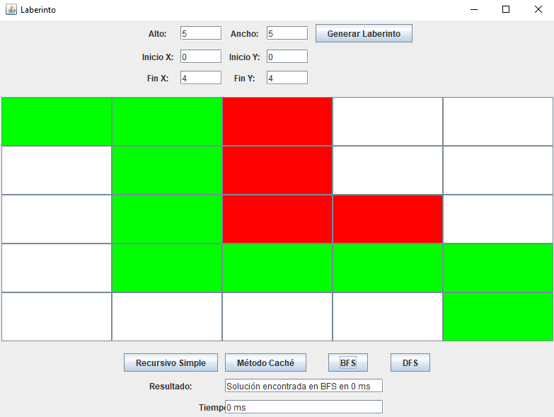
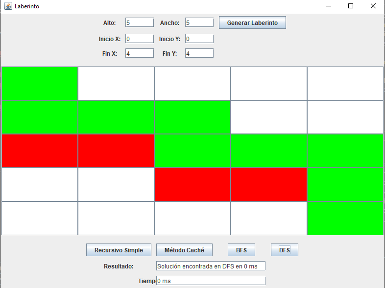

## INFORME DEL PROYECTO FINAL

- Carrera: Computación
- Materia: Estructura de Datos
- Integrantes: Valeria Mantilla y Claudia Quevedo
- correos: amantillac3@est.ups.edu.ec / cquevedor@est.ups.edu.ec

## Descripción del problema
Desarrollar una aplicación que implemente un algoritmo para encontrar la ruta óptima desde un punto de inicio (A) hasta un punto de destino (B) en un laberinto. Este proyecto debe utilizar conceptos avanzados de programación dinámica y estructuras de datos lineales y no lineales.

## Propuesta de solución:
## Marco Teórico
- Programación dinámica: Es una técnica de optimización en algoritmos que resuelve problemas complejos al descomponerlos en subproblemas más simples, almacenando sus resultados para evitar cálculos redundantes. Esto se logra mediante dos enfoques principales: top-down (con memorización) y bottom-up (tabulación). Al abordar cada subproblema de forma independiente y reutilizar sus soluciones almacenadas, se mejora significativamente la eficiencia de algoritmos recursivos, comúnmente aplicados en problemas de optimización como la secuencia de Fibonacci.
- BFS(Breadth-First Search): Algoritmo de búsqueda en grafos que  explora todos los vértices vecinos en el nivel actual antes de pasar al siguiente nivel.
- DFS(Depth-First Search): Algoritmo de búsqueda en grafos que explora tanto como sea posible a lo largo de cada rama antes de retroceder.

## Descripción de la propuesta de solución, herramientas y/o lenguajes que usaron.
Se desarrollo 4 métodos para encontrar la ruta entre A y B:
o Método recursivo simple
o Método aplicando cache (programación dinámica)
o BFS (Breadth-First Search)
o DFS (Depth-First Search)
- MVC: Este patrón fue implementado para la organización del código.
- Estructura de Datos: Implementación de estructuras de datos adecuadas para representar el laberinto y almacenar las rutas. Cada método de solución deberá estar en un método de código independiente y podrá recibir y devolver los argumentos que crean necesarios.
- GUI(Graphical User Interface): Diseño de una interfaz simple para la entrada de laberintos y visualización de la ruta óptima. Se Permite la configuración del tamaño del laberinto y las celdas transitables o no transitables a través del código. Se Permite la configuración de los puntos de partida y final a través del código.
- Lenguaje: Se utilizo Java para la implementación del algoritmo y la interfaz de usuario.
## Criterio por integrante de su propuesta.
- Claudia Quevedo: Me enfoqué en la implementación y comparación de los algoritmos BFS y DFS, así como en el diseño de un modo de simulación educativa. Este modo permite a los estudiantes experimentar con los algoritmos aprendidos, observar en tiempo real cómo encuentran soluciones y comparar su eficacia. Esta simulación educativa no solo refuerza los conceptos teóricos mediante la práctica, sino que también ayuda a los estudiantes a entender las fortalezas y debilidades de cada método en diferentes escenarios de laberintos.
- Valeria Mantilla: Nuestra propuesta se centra en la aplicación de algoritmos de búsqueda y optimización para encontrar rutas en laberintos. He contribuido especialmente en la implementación del método de programación dinámica, que mejora la eficiencia al evitar cálculos redundantes y permite encontrar la ruta óptima de manera más rápida. Además, he trabajado en la integración de la GUI, facilitando la interacción del usuario con el programa y la visualización de los resultados de manera clara y comprensible.
## Capturas de la implementación final de la UI.

## Conclusiones:
En el proyecto se compararon varios métodos para encontrar el camino más corto en un laberinto: métodos recursivos, BFS, DFS y programación dinámica. Aunque el método recursivo es simple, no es eficiente para laberintos grandes porque consume mucha memoria y tiempo. Se ha descubierto que BFS es adecuado para encontrar el camino más corto en términos de número de aristas, pero la eficiencia del tiempo disminuye en laberintos grandes. DFS, aunque es eficiente en términos de memoria, no garantiza que se encontrará la ruta más corta. La técnica de programación dinámica ahorra tiempo y espacio al evitar cálculos redundantes, lo que ha demostrado ser la mejor opción en general. Este análisis nos permite mejorar nuestro conocimiento de estructuras de datos y algoritmos, mejorando el pensamiento algorítmico y la competencia en la resolución de problemas.

## Consideraciones(por estudiante):
- Valeria Mantilla: 
Análisis y Visualización de Resultados: Implementar gráficos y estadísticas que muestren el rendimiento de cada algoritmo en términos de tiempo de ejecución, consumo de memoria, y número de pasos. Esto permitiría a los usuarios comparar fácilmente la eficacia de los diferentes métodos empleados.
- Claudia Quevedo: Se podría desarrollar un modo de simulación educativa donde los estudiantes puedan experimentar con algoritmos aprendidos en diferentes laberintos. Este modo permitiría a los estudiantes ver en tiempo real cómo los algoritmos encuentran soluciones, comparar su eficacia en términos de tiempo de ejecución y número de pasos, y entender las fortalezas y debilidades de cada método. Así, se refuerzan los conceptos aprendidos en la teoría mediante la práctica interactiva y visual.