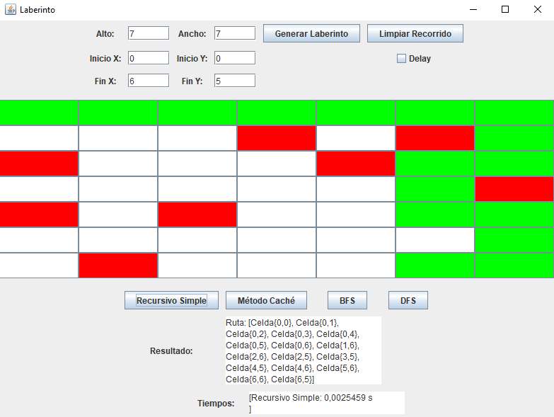
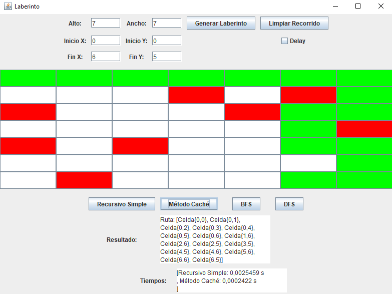
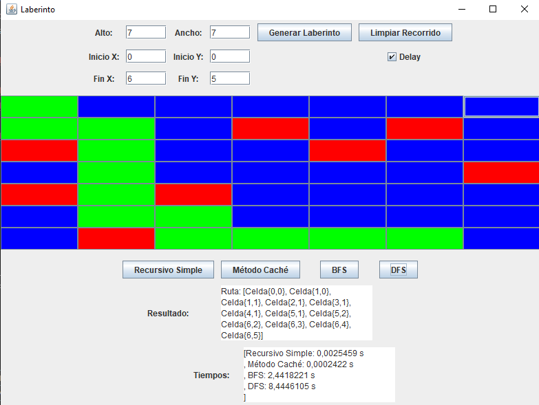

## INFORME DEL PROYECTO FINAL

- Carrera: Computación
- Materia: Estructura de Datos
- Integrantes: Valeria Mantilla y Claudia Quevedo
- correos: amantillac3@est.ups.edu.ec / cquevedor@est.ups.edu.ec

## Descripción del problema
Desarrollar una aplicación que implemente un algoritmo para encontrar la ruta óptima desde un punto de inicio (A) hasta un punto de destino (B) en un laberinto. Este proyecto debe utilizar conceptos avanzados de programación dinámica y estructuras de datos lineales y no lineales.

## Propuesta de solución:
## Marco Teórico
- Programación dinámica: Es una técnica de optimización en algoritmos que resuelve problemas complejos al descomponerlos en subproblemas más simples, almacenando sus resultados para evitar cálculos redundantes. Esto se logra mediante dos enfoques principales: top-down (con memorización) y bottom-up (tabulación). Al abordar cada subproblema de forma independiente y reutilizar sus soluciones almacenadas, se mejora significativamente la eficiencia de algoritmos recursivos, comúnmente aplicados en problemas de optimización como la secuencia de Fibonacci.
- BFS(Breadth-First Search): Algoritmo de búsqueda en grafos que  explora todos los vértices vecinos en el nivel actual antes de pasar al siguiente nivel.
- DFS(Depth-First Search): Algoritmo de búsqueda en grafos que explora tanto como sea posible a lo largo de cada rama antes de retroceder.

## Descripción de la propuesta de solución, herramientas y/o lenguajes que usaron.
Se desarrollo 4 métodos para encontrar la ruta entre A y B:
o Método recursivo simple
o Método aplicando cache (programación dinámica)
o BFS (Breadth-First Search)
o DFS (Depth-First Search)
- MVC: Este patrón fue implementado para la organización del código.
- Estructura de Datos: Implementación de estructuras de datos adecuadas para representar el laberinto y almacenar las rutas. Cada método de solución deberá estar en un método de código independiente y podrá recibir y devolver los argumentos que crean necesarios.
- GUI(Graphical User Interface): Diseño de una interfaz simple para la entrada de laberintos y visualización de la ruta óptima. Se Permite la configuración del tamaño del laberinto y las celdas transitables o no transitables a través del código. Se Permite la configuración de los puntos de partida y final a través del código.
- Lenguaje: Se utilizo Java para la implementación del algoritmo y la interfaz de usuario.
## Criterio por integrante de su propuesta.
- Claudia Quevedo: Optamos por una propuesta sencilla que integre los métodos de BFS, DFS, método recursivo simple y método con caché con una interfaz gráfica amigable y de fácil compresión. Como se indicó en el proyecto original, nos basamos en la creación de un laberinto, ya que esta es la forma más sencilla y visual de evidenciar el funcionamiento adecuado de los métodos anteriormente mencionados. Dentro de los desafíos más complicados a la hora de crear el programa, fue el hecho de conectar la vista con el modelo de forma práctica.

- Valeria Mantilla: Nuestra propuesta de código se centro en la elaboración de una interfaz grafica simple con lenguaje en java, se ejecuto siguiendo el ejemplo planteado por el Ingeniero, los métodos Recursivo Simple, método con caché, BFS y DFS, creados en la Clase Laberinto fueron generados con el Ingeniero pero alterados para que concuerde con las demás variables de nuestras clases y se puedan ejecutar sin problema alguno, opino que lo que más nos costo realizar en nuestro código fue el GUI y el controlador con los parametros de vista y modelo.
## Capturas de la implementación final de la UI.
## Recursivo Simple

## Método Caché

## BFS

## DFS

## Conclusiones:
En el proyecto se compararon varios métodos para encontrar el camino más corto en un laberinto: métodos recursivos, BFS, DFS y programación dinámica. Aunque el método recursivo es simple, no es eficiente para laberintos grandes porque consume mucha memoria y tiempo. Se ha descubierto que BFS es adecuado para encontrar el camino más corto en términos de número de aristas, pero la eficiencia del tiempo disminuye en laberintos grandes. DFS, aunque es eficiente en términos de memoria, no garantiza que se encontrará la ruta más corta. La técnica de programación dinámica ahorra tiempo y espacio al evitar cálculos redundantes, lo que ha demostrado ser la mejor opción en general. Este análisis nos permite mejorar nuestro conocimiento de estructuras de datos y algoritmos, mejorando el pensamiento algorítmico y la competencia en la resolución de problemas.
Según nuestra investigación de los métodos desarrollados para encontrar la ruta más corta es del BFS.

## Consideraciones(por estudiante):
- Valeria Mantilla: El  desarrollo con componentes más avanzados y prácticos en nuestra GUI, para una mejor calidad de presentación para el Usuario, mejor presentación del Resultado añadiendo los pasos por los que recorre cada algoritmo de búsqueda.

- Claudia Quevedo: Considero que seria más apto mejorar no solamente la interfaz, si no que también mejorar la parte del código, haciendo métodos más eficaces y teniendo códigos más cortos.